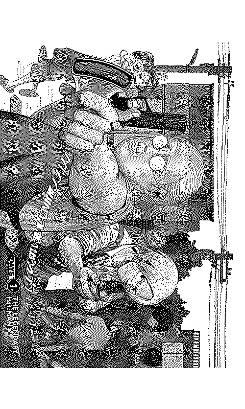
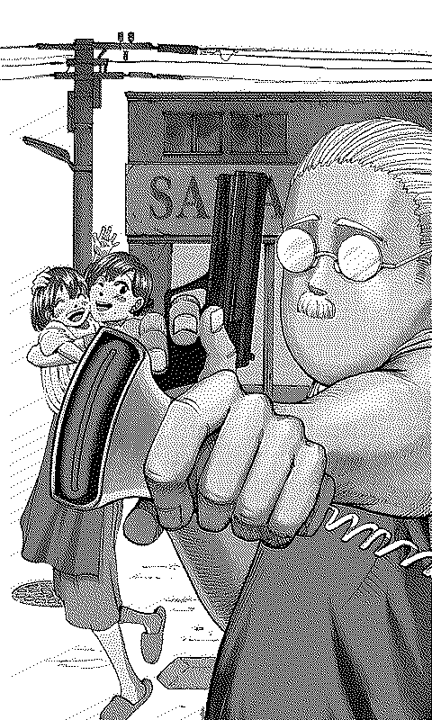
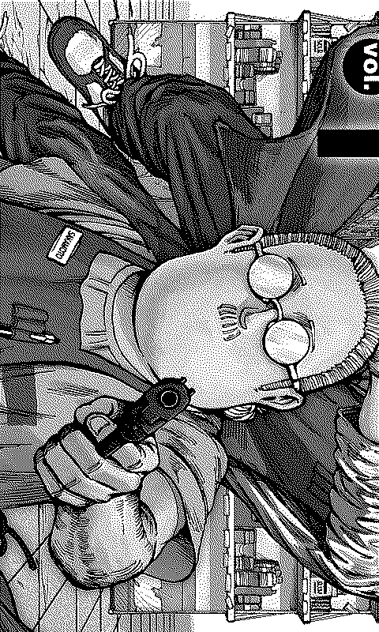
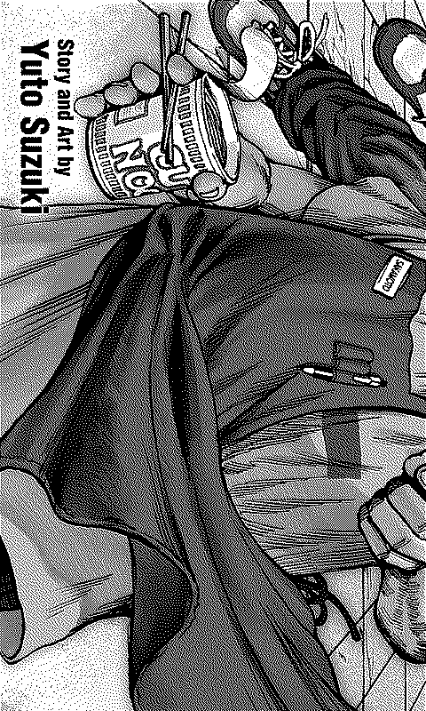
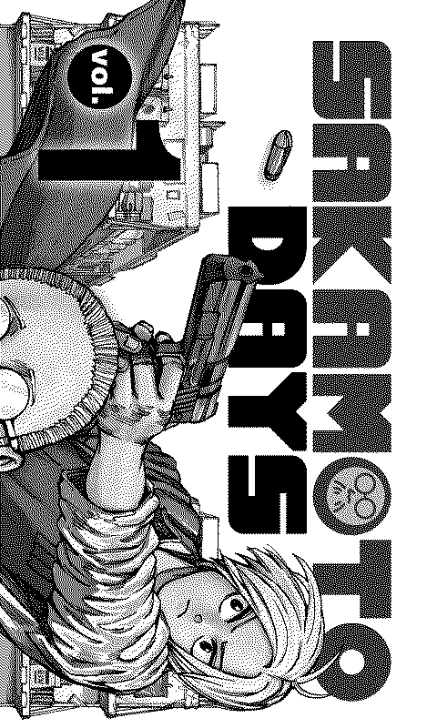
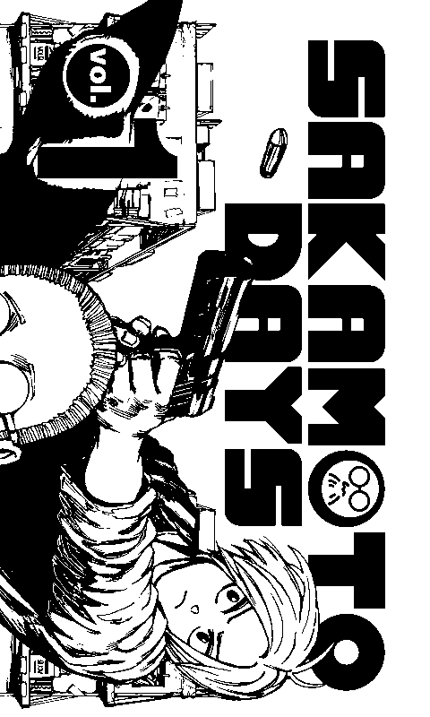
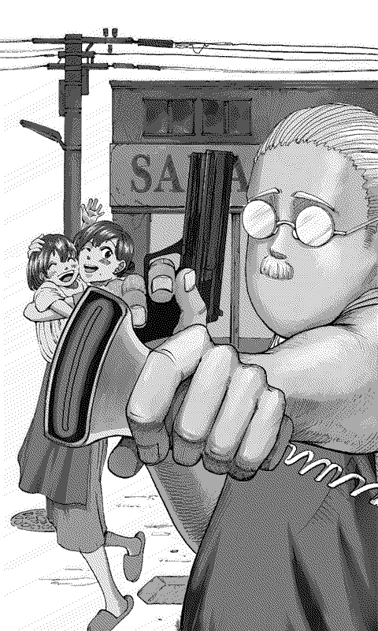

# XTEink Manga Tools

Tools for converting CBZ, PDF, and images to XTC/XTCH format for the XTEink X4 e-reader.

## Installation

### 1. Install Python
- **Windows**: Download from [python.org](https://www.python.org/). During installation, check "Add Python to PATH".
- **macOS**: Run `brew install python` or download from [python.org](https://www.python.org/).
- **Linux**: Usually pre-installed. If not, use `sudo apt install python3`.

### 2. Install Required Libraries
Open your terminal (Command Prompt on Windows, Terminal on macOS/Linux) and run:
```bash
pip install pillow numpy numba pymupdf
```

### 3. PDF Support (Optional)
- For `cbz2xtc.py`: `pymupdf` (installed above) is used.
- For `cbz2xtcpoppler.py`: Install `poppler-utils`.
  - **macOS**: `brew install poppler`
  - **Linux**: `sudo apt install poppler-utils`
  - **Windows**: Download binaries and add to PATH.

## How to Run

1. Place your `.cbz` or `.pdf` files in a folder.
2. Open your terminal in that folder.
3. Run the script:

**Windows**:
```cmd
python cbz2xtc.py --2bit --clean
```

**macOS / Linux**:
```bash
python3 cbz2xtc.py --2bit --clean
```

## Tools

### cbz2xtc.py
Processes multiple pages and files in parallel.
- **Split segments**: Automatically cuts landscape spreads into upright portrait pieces.
- **Overviews**: Generates full-page views to show the layout before the splits.
- **Fast Encoding**: Uses NumPy to process images quickly.

### image2xth.py
Converts a single image (like a wallpaper) to XTCH format.

### image2bw.py
Converts a single image to 1-bit BMP format.

## Options Reference

| Option | Effect |
| :--- | :--- |
| `--2bit` | Use 4-level grayscale (higher quality). |
| `--manhwa` | Use 50% overlap for long-strip webtoons. |
| `--landscape-rtl` | Process wide pages from Right-to-Left (for Japanese manga). |
| `--include-overviews` | Add an upright full-page preview before segments. |
| `--sideways-overviews` | Add a rotated full-page preview (-90 degrees). |
| `--gamma 0.7` | Brighten the image (use values like 0.5 to 0.9). |
| `--clean` | Delete temporary files after the conversion is done. |

## Visual Samples

The tool splits images into segments to fill the screen correctly. Here is how a wide spread is handled:

| Type | Image | Filename | Description |
| :--- | :---: | :--- | :--- |
| **Overview** |  | `_overview.png` | Full view of the spread. |
| **Segment A** |  | `_3_a.png` | First part (Left side by default). |
| **Segment B** |  | `_3_b.png` | Middle part (Overlap). |
| **Segment C** |  | `_3_c.png` | Last part (Right side by default). |

*Note: For Japanese manga, use `--landscape-rtl` so that Segment A is the Right side.*

### Dithering and Quality Previews

| Option | Preview | Description |
| :--- | :---: | :--- |
| **Atkinson** |  | Default. Sharp and clean shading. |
| **Floyd-Steinberg** |  | Smoother gradients, traditional look. |
| **No Dithering** |  | Pure Black & White. Best for text. |
| **2-bit Grayscale** |  | 4 levels of gray. Highest quality. |

## Specifications

- **Device:** XTEink X4.
- **Screen Size:** 480×800 pixels.
- **Format:** Vertical scan, columns Right-to-Left (XTCH).
