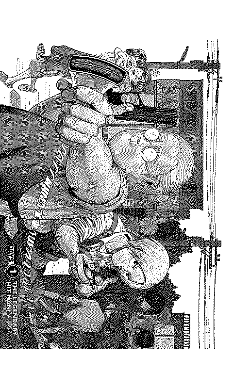
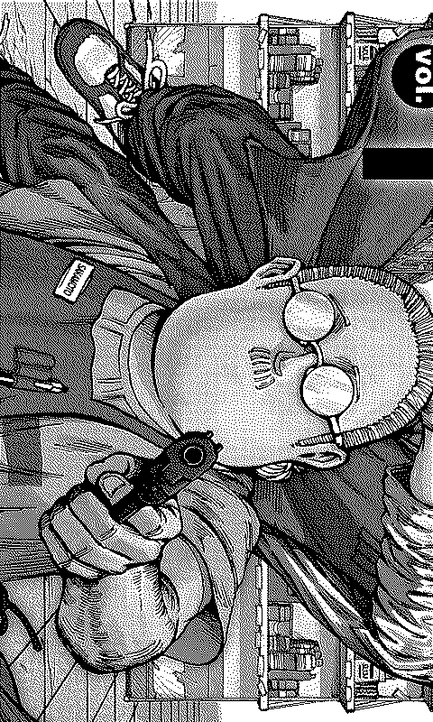
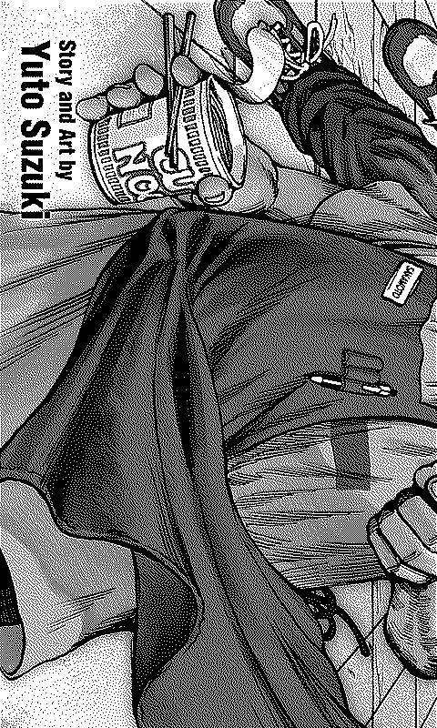
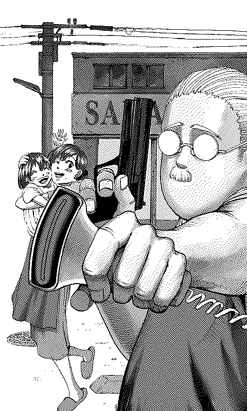
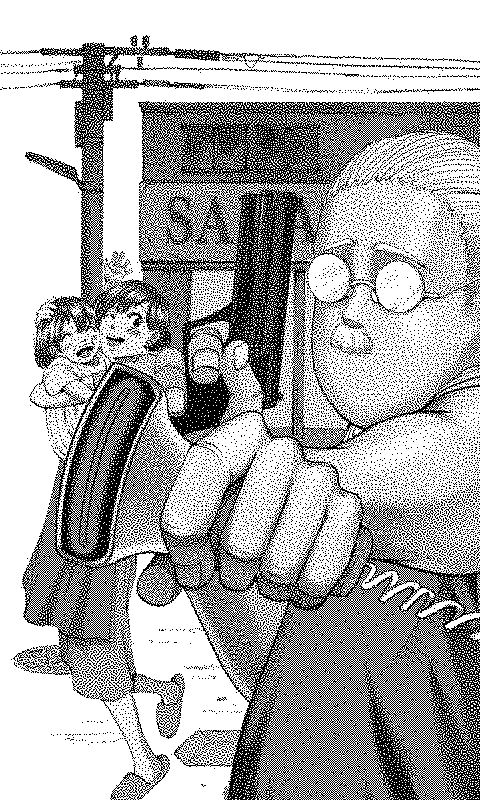
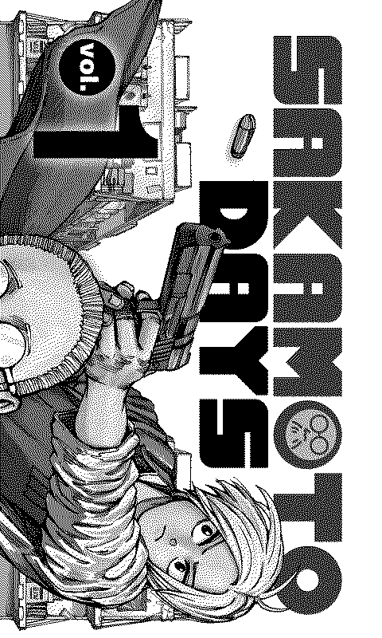
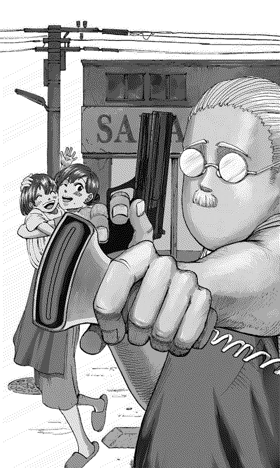

# XTEink Manga Tools 

A comprehensive suite of tools for converting various media formats (CBZ, PDF, images, webpages, and videos) into the highly optimized XTC/XTCH format specifically designed for the XTEink X4 e-reader.

These tools are designed to maximize the reading experience on e-ink displays by offering advanced dithering, efficient panel splitting, and fast rendering.

## Key Features
- **Multi-format Support:** Convert from archives (CBZ), documents (PDF), websites, videos, and raw images.
- **Smart Formatting:** Auto-split landscape spreads into portrait panels, generate overviews, and support long-strip manhwa/webtoon scrolling.
- **E-ink Optimization:** Multiple dithering algorithms for e-ink limited bit depth.
- **High Performance:** Utilizes NumPy, Numba, and parallel processing for fast conversions.
- **Space Saving:** Optional LZ4 compression (`.xtcz`) maintains fast decoding speeds while significantly reducing file sizes.

---

## The Tools

### `cbz2xtc.py`
Processes multiple pages and files in parallel. Ideal for standard manga and comic archives.
- **Split segments**: Automatically cuts landscape spreads into upright portrait pieces.
- **Overviews**: Generates full-page views to show the layout before the splits.
- **Fast Encoding**: Uses NumPy to process images quickly.

### `cbz2xtcpoppler.py`
An alternative PDF converter that uses Poppler for potentially better rendering on complex PDFs.

### `web2xtc.py`
Converts websites directly to XTC/XTCH format. Perfect for web novels or online manga.
- **Full Page Capture**: Screenshots the entire scrolling page.
- **Dynamic Mode**: Expands dropdowns and crawls links (chapters/sub-pages).
- **Mobile/Desktop**: Emulates Mobile or Desktop viewports.

### `video2xtc.py`
Converts video files (MP4, MKV, AVI, etc.) to XTC/XTCH format.
- **FPS Control**: Extract frames at a custom rate (e.g., 1 frame per second).
- **Auto-Rotation**: Automatically rotates landscape videos to fit the portrait screen.
- **High Performance**: Uses FFmpeg for extraction and Numba for fast dithering.

### `image2xth.py`
Converts a single image (like a wallpaper) to XTCH (2-bit grayscale) format.
- Supports **Cover**, **Letterbox**, and **Fill** modes.

### `image2bw.py`
Converts a single image to 1-bit BMP format (perfect for fast-loading backgrounds).

### `xtc2xtcz.py`
Compresses existing `.xtc` and `.xtch` files into the LZ4-compressed `.xtcz` format to significantly reduce file sizes while maintaining fast decoding speeds on the device.

---

## Installation

### 1. Install Python
Ensure Python 3 is installed on your system.
- **Windows**: Download from [python.org](https://www.python.org/). *Crucial: During installation, ensure you check "Add Python to PATH".*
- **macOS**: Run `brew install python` or download from [python.org](https://www.python.org/).
- **Linux**: Usually pre-installed. If not, use `sudo apt install python3 python3-pip`.

### 2. Install Required Libraries
Open your terminal (Command Prompt/PowerShell on Windows, Terminal on macOS/Linux) and run:
```bash
pip install pillow numpy numba pymupdf playwright lz4
```

### 3. Web Support (For `web2xtc.py`)
After installing the `playwright` library above, you must install the browser binaries:
```bash
playwright install
```

### 4. Video Support (For `video2xtc.py`)
You must install `ffmpeg` and have it available in your system's PATH.
- **macOS**: `brew install ffmpeg`
- **Linux**: `sudo apt install ffmpeg`
- **Windows**: Download from [ffmpeg.org](https://ffmpeg.org/download.html) and add the `bin` folder to your PATH environment variable.

### 5. PDF Support
- For `cbz2xtc.py`: The `pymupdf` library (installed in step 2) is used by default.
- For `cbz2xtcpoppler.py`: You must install `poppler-utils`.
  - **macOS**: `brew install poppler`
  - **Linux**: `sudo apt install poppler-utils`
  - **Windows**: Download the Poppler binaries and add them to your PATH.

---

## How to Run

1. Place your source files (`.cbz`, `.pdf`, `.mp4`, etc.) in a folder.
2. Open your terminal in that folder.
3. Run the appropriate script:

**Windows**:
```cmd
python cbz2xtc.py <options>
```

**macOS / Linux**:
```bash
python3 cbz2xtc.py <options>
```

### Specific Script Usage
- **Website Converter:** `python3 web2xtc.py "https://example.com/manga" <options>`
- **Video Converter:** `python3 video2xtc.py movie.mp4 <options>`

---

## Options Reference

### General Options (`cbz2xtc`, `web2xtc`, `video2xtc`, and `image2xth`)
| Option | Effect |
| :--- | :--- |
| `--2bit` | Use 4-level grayscale (higher quality). Recommended for detailed artwork. |
| `--compress` | Compress output using LZ4 into an `.xtcz` file (saves storage space). |
| `--downscale <filter>` | Downscaling filter: `bicubic` (default), `bilinear`, `box`. |
| `--manhwa <overlap>` | Use long-strip mode (default 40% overlap) for webtoons (cbz/web only). |
| `--landscape-page-split <mode>`| Split wide pages. Default is `none` (overview only). Use `rtl` for Japanese manga, `ltr` for western comics. |
| `--include-overviews` | Add an upright full-page preview before segments. |
| `--sideways-overviews` | Add a rotated full-page preview (-90 degrees). |
| `--gamma <value>` | Brighten/Darken the image. Use `<1` to brighten and `>1` to darken (Default: 1). |
| `--clean` | Delete temporary files after the conversion is done. |
| `--dither <algorithm>` | Dithering method: `stucki`(default), `atkinson`, `ostromoukhov`, `zhoufang`(recommended for e-ink), `stochastic`, `floyd`, `ordered`, `none`. |

### Image Options (`video2xtc.py` only)
| Option | Effect |
| :--- | :--- |
| `--xtg` | For 1-bit XTG image. |
| `--mode` | Change the scaling mode to (letterbox, fill, crop) |


### Video Options (`video2xtc.py` only)
| Option | Effect |
| :--- | :--- |
| `--fps 1.0` | Frames per second to extract (Default: 1.0). Adjust based on action speed. |
| `--invert` | Invert colors (White <-> Black). Useful for dark mode videos. |

### Web Options (`web2xtc.py` only)
| Option | Effect |
| :--- | :--- |
| `--dynamic` | Expands menus and crawls 1st-page links (chapters). |
| `--parallel-links` | Crawls sub-links in parallel (significantly faster). |
| `--viewport mobile` | Use mobile layout (iPhone 13 Pro emulation). Default is desktop. |
| `--cookies file.txt` | Load cookies from a Netscape-formatted file (useful for logged-in sessions). |

---

## CLI Examples

Open your terminal and run the following commands as needed. Each example demonstrates a common real-world scenario.

### Manga & PDF Conversion (`cbz2xtc.py`)
*(Default output is 1-bit `.xtc`. Use `--2bit` for `.xtch` 4-level grayscale.)*

*   **XTCH Japanese Manga (RTL):**
    Splits wide spreads from right-to-left, adds rotated overviews, and uses 2-bit grayscale.
    ```bash
    python3 cbz2xtc.py --2bit --landscape-page-split rtl --sideways-overviews --downscale bicubic
    ```

*   **Webtoons / Manhwa (Long-Strip):**
    Processes as a continuous vertical strip with 40% overlap(default) between screens.
    ```bash
    python3 cbz2xtc.py --manhwa --downscale bicubic
    ```

*   **Advanced Image Tuning:**
    Boosts contrast (level 3) and automatically crops 5% off all margins to remove scans' white edges.
    ```bash
    python3 cbz2xtc.py --contrast-boost 3 --margin 5 --dither zhoufang
    ```

*   **Targeted Page Range:**
    Only process pages 10 through 50, skipping page 25.
    ```bash
    python3 cbz2xtc.py --start 10 --stop 50 --skip 25
    ```

###  Website Converter (`web2xtc.py`)

*   **Standard Desktop Article:**
    Captures a website in desktop mode with high-quality dithering.
    ```bash
    python3 web2xtc.py "https://en.wikipedia.org/wiki/Manga" --dither zhoufang
    ```

*   **Mobile Webtoon Reading:**
    Uses mobile viewport emulation and parallel link crawling for chapters.
    ```bash
    python3 web2xtc.py "https://example.com/chapter-1" --viewport mobile --dynamic --parallel-links
    ```

*   **Authenticated Session:**
    Uses a cookies file to access content behind a login.
    ```bash
    python3 web2xtc.py "https://private-site.com/" --cookies my_cookies.txt --viewport mobile
    ```

### Image & Video Tools

*   **Single Wallpaper (2-bit):**
    ```bash
    python3 image2xth.py wallpaper.png --downscale bicubic
    ```

*   **Video to E-ink Frames:**
    Extracts frames at 1 FPS
    ```bash
    python3 video2xtc.py "movie.mp4" --fps 1 --2bit
    ```

### Post-Processing

*   **Batch Compression:**
    Compresses all existing `.xtc` and `.xtch` files in a folder into LZ4 `.xtcz` format.
    ```bash
    python3 xtc2xtcz.py xtc_output/
    ```

---

## 🖼️ Visual Samples

### Landscape Page Splitting
The tool intelligently splits wide images into segments to fill the portrait screen correctly without losing context. Here is how a wide spread is handled:

| Type | Image | Filename | Description |
| :--- | :---: | :--- | :--- |
| **Overview** |  | `_overview.png` | Full view of the spread before splitting. |
| **Segment A** |  | `_3_a.png` | First part (Left side by default). |
| **Segment B** |  | `_3_b.png` | Middle part (Overlap to ensure no text is cut). |
| **Segment C** |  | `_3_c.png` | Last part (Right side by default). |

*💡 Note: For Japanese manga, use `--landscape-page-split rtl` so that Segment A starts on the Right side.*

### Dithering Algorithms and Quality Previews
Dithering is crucial for e-ink displays to simulate grayscale using only black and white pixels (or 4 levels of gray).

| Option | Preview | Description |
| :--- | :---: | :--- |
| **Stucki** |  | **Default.** High-quality error diffusion. Balanced for most content. |
| **Atkinson** |  | Sharp and clean shading. Excellent for high-contrast line art. |
| **Stochastic** |  | Velho SFC Error Diffusion (Structure-aware). Good for complex textures. |
| **Floyd-Steinberg** |  | Smoother gradients, traditional retro look. |
| **No Dithering** |  | Pure Black & White. Best for text-only pages to keep edges crisp. |
| **2-bit Grayscale** |  | 4 levels of gray. **Highest overall quality** if your device supports it. |

---
*Tip: For the absolute best reading experience on XTEink devices, experiment with `--dither zhoufang` and `--2bit` depending on the source material.*
